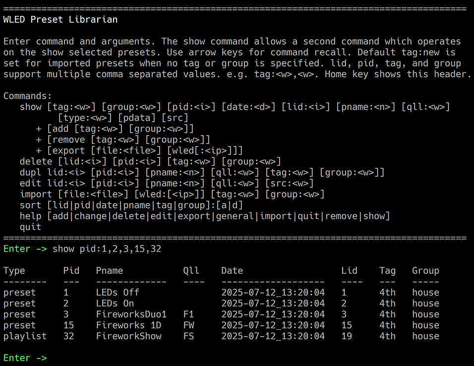

**WledLibrarian.pl** 
A simple WLED preset librarian with old school CLI user interface. It is used to import WLED 
presets as individual entities into a database. These preset data can be tagged and grouped by 
the user as needed. For example, 'xmas' might identify the presets used in a holiday display. 
Presets can be selected ad-hoc or by tag/group word for export to a WLED presets file or 
directly to WLED over WIFI. 

Coded in Perl, the librarian utilizes the DBD:SQLite module which is a self-contained RDBMS database. 
Librarian commands provide the database interfacing functions. SQLite provided tools, e.g. sqlite3, 
can also be used to access/modify the database file.The librarian code performs a database check 
during startup. It will report an error and terminate if the expected tables and their columns 
are not present.

The program reformats the preset JSON during import to improve user readability. This has been tested 
with a number of LED strip types, primarily WS2815, and ESP32. Other hardware combinations may reveal 
errors due to untested WLED json keys. A CLI option is available to disable this processing.
  

