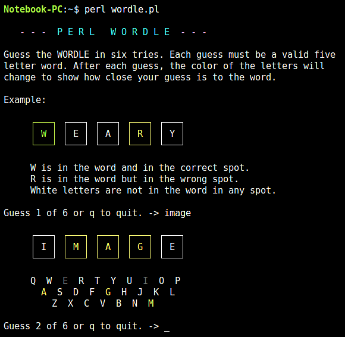

## Wordle.pl
This program is a perl based adaptation of the word guessing game Wordle.
It is run from the terminal/command line and uses ANSI color sequences to
color the letter clues that are output after each guess. Coded and debugged
using Linux Mint 22.3, Windows 7, and, perl v5.40. Coded as an exercise in
ANSI color, character graphics, and cross-platform compatibility.

With respect to character graphics, considerable time was spent in making the 
program functional in linux and windows environments. Linux uses UTF8 characters
for drawing boxes around the letters. In windows, code page CP437 characters 
are used. Couldn't get UTF8 to work with windows Strawberry perl though that 
effort is still ongoing. 

In windows, an escape sequence `\e(437X` is needed to tell Win32::Console::ANSI that
CP437 characters are used. See https://bribes.org/perl/wANSIConsole.html for 
details. This took more time than I care to admit to work out. For an 
additional environmental workaround, the startup `-a` option can be used 
to disable box drawing. Use the `-2` option for double line letter boxes.

The file `wordle-word-list.txt` contains the valid words used by the program.
A random word is selected from the file during program start. The file
`wordle-clue-list.txt` contains words that are valid input but not selected
as a target word. Both files must be located with the program file. After
the first program run, the file `wordle-stats.txt` will be created to hold 
the game play statistics.

